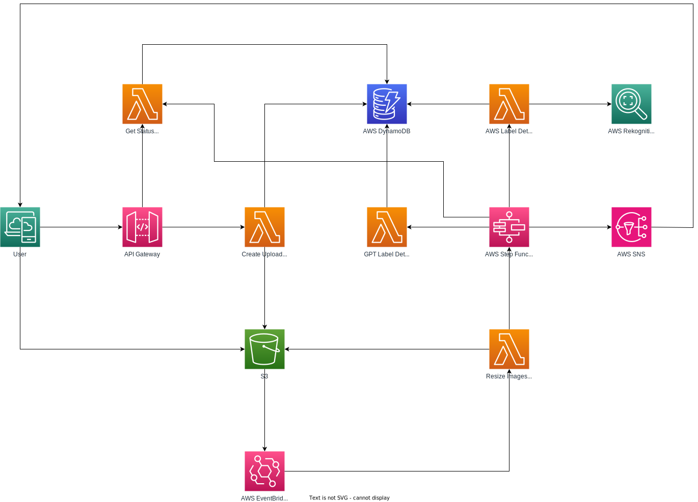

# Azatiko Image Classification - Label Detection Application

## Introduction

Welcome to the Azatiko Image Classification's Label Detection Application. This innovative solution is specifically
designed for enhancing the digital experience on real estate listing websites. Developed using the AWS Cloud Development
Kit (CDK), this application seamlessly integrates with the Azatiko platform to provide advanced image recognition and
classification capabilities.

### Purpose

In the fast-paced world of real estate, the ability to quickly and accurately categorize images is paramount. Our
application addresses this need by automatically detecting and classifying photos uploaded to property listings. By
leveraging cutting-edge technology, it streamlines the process of managing and displaying images, ensuring that each
listing is both appealing and informative.

### Key Features

- **Automatic Detection and Classification**: Utilizes AWS Rekognition and GPTVision to accurately identify and
  categorize real estate images.
- **Enhanced Search and Sorting**: Improves the search functionality on the website, enabling users to find relevant
  listings more efficiently.
- **Optimized Customer Experience**: Provides a more intuitive and user-friendly interface, making property exploration
  a seamless process.
- **Thumbnail Selection**: Smartly chooses the most relevant photo for display as a thumbnail, capturing the essence of
  each listing or with customer preferences in mind.
- **Sales Enhancement**: By showcasing properties more effectively, the application aids in increasing engagement and
  sales potential.

## Advantages of Infrastructure as Code (IaC) and AWS Serverless Services

### Infrastructure as Code (IaC) using TypeScript CDK

The application leverages the AWS Cloud Development Kit (CDK) with TypeScript, providing several key advantages:

- **Automated Environment Setup**: IaC allows for the automatic creation and management of cloud resources, ensuring
  consistent and error-free deployments.
- **Version Control and Collaboration**: With IaC, the infrastructure's codebase can be version-controlled, facilitating
  collaboration among team members.
- **Rapid Iteration and Scalability**: TypeScript CDK enables quick iterations and easy scaling of the infrastructure,
  accommodating the evolving needs of the application.
- **Customizable and Reusable Code**: CDK's flexibility allows for customization and reuse of code, significantly
  reducing development time and effort.

### AWS Serverless Services

Our application harnesses the power of various AWS serverless services, each contributing to its efficiency and
scalability:

- **AWS Step Functions**: Orchestrate the workflow of the image processing tasks, ensuring efficient and reliable
  execution of complex processes.
- **AWS Lambda**: Handle the computing tasks without the need to manage servers, offering both cost-efficiency and
  scalability.
- **Amazon DynamoDB**: Provide a fast and flexible NoSQL database service, enabling quick and reliable data retrieval
  and storage.
- **Amazon Rekognition**: Offer advanced image analysis capabilities, crucial for accurate image detection and
  classification in real estate listings.
- **Amazon API Gateway**: Facilitate secure and scalable API endpoints for the application, simplifying the integration
  with frontend and other services.
- **Amazon Simple Notification Service (SNS)**: Enable robust notifications, enhancing the application's
  responsiveness and user engagement.
- **Amazon Simple Storage Service (S3)**: Provide scalable and secure object storage, ideal for storing and retrieving
  the vast amounts of images associated with real estate listings.

By integrating these AWS serverless services, the application achieves high performance, scalability, and reliability,
ensuring an optimal experience.

## Hybrid Image Recognition Strategy: Amazon Rekognition and GPTVision

### Strategic Use of Amazon Rekognition

Our application initially employs Amazon Rekognition for image analysis. This choice offers several benefits:

- **Speed and Efficiency**: Rekognition provides rapid image analysis, making it highly suitable for processing large
  volumes of images swiftly.
- **Cost-Effectiveness**: Using Rekognition as the first line of analysis helps in reducing operational costs, as it is
  generally more cost-effective than more complex solutions.
- **Scalability**: Being an AWS service, it seamlessly scales with the application's demands, handling varying loads
  without manual intervention.

### Enhanced Accuracy with GPTVision

For cases where Amazon Rekognition is unable to classify images with the required accuracy, we turn to GPTVision. This
advanced image recognition solution offers:

- **Superior Accuracy**: GPTVision excels in understanding complex and nuanced images, providing a significant
  improvement in classification accuracy for challenging cases.
- **Complementary Technology**: It complements Rekognition by handling the more intricate image recognition tasks that
  require deeper cognitive understanding.

### Cost-Efficient and Scalable Architecture

By integrating both Amazon Rekognition and GPTVision, our application achieves a harmonious balance:

- **Optimized Cost and Performance**: Initial processing with Rekognition keeps costs low, while GPTVision is used
  selectively for complex cases, optimizing overall expenditure.
- **High Scalability and Speed**: This dual approach ensures that the application remains fast and scalable, handling
  rapid image processing without compromising on accuracy.
- **Best of Both Worlds**: Leveraging the strengths of both services, the application delivers high accuracy in image
  classification while maintaining operational efficiency and speed.

This architecture design is specifically tailored to provide our users with a fast, cost-effective, and highly accurate
image classification system, essential for enhancing the real estate listing experience.


## Architectural Overview

The architecture of our label detection application is designed for efficiency, scalability, and security. Here’s a
step-by-step walkthrough of the process:

### 1. User Request via API Gateway

- **Secured API Gateway**: User requests are handled through the API Gateway, which is secured with an API Key and a
  usage plan. The usage plan is throttled with a rate limit of 10 and a burst limit of 2 to protect against malicious
  requests.
- **Two Key Endpoints**:
    - **Get Upload URLs**: This endpoint accepts an array of images in a specified format, such
      as `{"id": "example-id", "type": "jpeg"}`. It responds with signed URLs and a unique request ID, which allows
      users to upload images directly to S3.
    - **Get Status**: This endpoint accepts a request ID and responds with the status of the request, including details
      like image IDs, classification, processing cost, time taken, and the service used.

### 2. S3 and Lambda for Image Processing

- **Image Upload to S3**: Users upload images to S3 using the provided signed URLs.
- **Triggered Lambda Function**: The upload to S3 triggers a Lambda function that resizes the images for optimal
  processing.

### 3. Step Function for Workflow Management

- **Step Function Invocation**: Once all images are resized, the AWS Step Function is invoked to manage the workflow.
- **Lambda for Initial Classification**: A Lambda function attempts to classify each image using Amazon Rekognition and
  updates the status in DynamoDB.
- **Handling Unclassified Images**: If some images remain unclassified, another Lambda function is triggered to use the
  GPTVision API for further classification. The results are updated in DynamoDB.

### 4. Finalizing and Notifying Status

- **Status Compilation**: The GetStatus Lambda function (also used for the API endpoint) compiles the status of all
  images from DynamoDB.
- **Notification via SNS**: The final status is outputted to the Step Function, triggering an SNS notification. All
  subscribers are then notified about the status of the image processing.

This architectural design ensures a streamlined process for image classification, balancing speed, accuracy, and
cost-effectiveness. It leverages the best of AWS services and cutting-edge image recognition technologies to deliver an
unparalleled user experience.

Architectural Diagram


## Deployment Steps

Deploying the label detection application is straightforward, but it requires some prerequisites and specific steps to
ensure a successful setup. Follow these steps to deploy the application in your AWS environment.

### Prerequisites

1. **Node.js**: Ensure Node.js version 18 or higher is installed on your system.
2. **AWS Profile**: Configure your AWS profile, as this will be used in the `cdk deploy` command.
3. **Initial Setup for New AWS Environments**:
    - If deploying in a new AWS environment, run `cdk bootstrap` to initialize the CDK environment.
4. **GPT API Key in SSM**:
    - Since the CDK application uses AWS Systems Manager (SSM) to fetch the GPT API key, ensure the key is created in
      the
      same region where the deployment will occur.
        - The GPT API key should be added to the SSM parameter store under the path specified
          in `lib/constants/index.ts`, which
          currently is:
          ```typescript
          export const GPT_API_KEY_SSM_PARAMETER_NAME = "/image-classification/gpt-api-key";
          ```
5. **Application Configuration**:
    - Update the AWS region in `lib/constants/index.ts` if needed. The current setting is:
      ```typescript
      export const AWS_REGION = "ap-southeast-1";
      ```

### Deployment Process

1. **Install Dependencies at Root**:
    - Navigate to the root of the application directory and run:
      ```
      npm install
      ```
2. **Prepare Lambda Sharp Layer**:
    - Change directory to `lib/lambda/sharp-layer/nodejs` and execute the following commands:
      ```
      npm install
      rm -rf node_modules/sharp
      SHARP_IGNORE_GLOBAL_LIBVIPS=1 npm install --arch=x64 --platform=linux --libc=glibc sharp
      ```
3. **Deploy with CDK**:
    - Return to the root of the application and deploy using AWS CDK by running:
      ```
      # run this command from the root folder of the project
      cdk deploy --all --require-approval never --profile <configured profile name>
      ```
      Replace `<configured profile name>` with your configured AWS profile name.
      Newer versions require a new package:
      ```
      npm install aws-cdk-lib
      ```

### Post-Deployment

- Upon successful deployment, the CDK will output the API Base URL. Make a note of these as they will be
  required for accessing and using the application's functionalities.

By following these steps, your label detection application will be successfully deployed and ready for use in your AWS
environment.

## Adjusting AWS Service Quotas and Obtaining GPT API Key

For the optimal functioning of the label detection application, it may be necessary to adjust AWS service quotas and
obtain an API key for GPT from OpenAI. Below are the steps and resources to assist you in these tasks.

### Adjusting AWS Service Quotas

To ensure that your AWS environment can handle the workload of the application, you might need to adjust the service
quotas for various AWS services like Amazon Rekognition. Use the following link to access the AWS Service Quotas console
and modify the quotas as required for your deployment region:

- [Adjust AWS Service Quotas](https://ca-central-1.console.aws.amazon.com/servicequotas/home/services/rekognition/quotas/L-A5121FD7)

### Obtaining GPT API Key from OpenAI

1. **Get API Key for GPT**:
    - To use GPTVision in the application, an API key from OpenAI is required. Visit the following link to create or
      access your API keys:
        - [OpenAI API Keys](https://platform.openai.com/api-keys)
    - Follow the instructions to generate a new API key if you don’t already have one.
2. **Understanding API Usage Limits**:

- It’s also important to be aware of the usage limits associated with your OpenAI account. You can view and manage these
  limits at:
    - [OpenAI Account Limits](https://platform.openai.com/account/limits)
